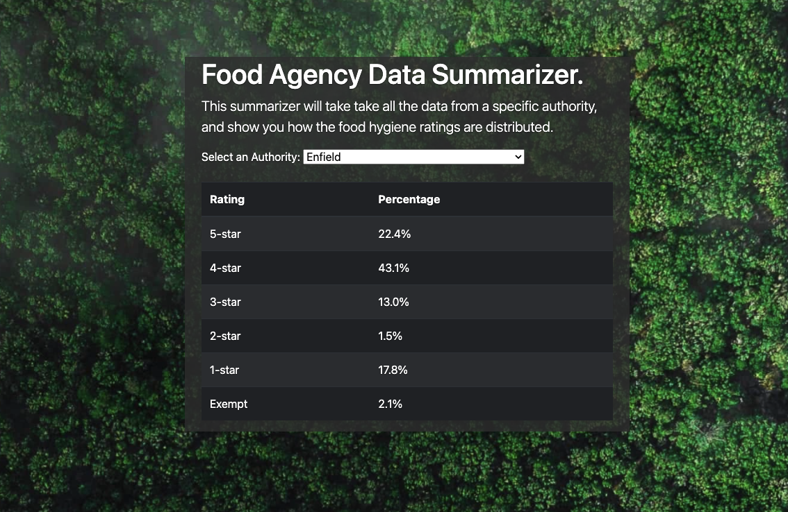

# Aviva Zero - Full Stack Tech Test: TypeScript

## Prerequisites

- Node.js >=8
- yarn
- Access to the internet
- Suitable development environment

## Getting Started

- Install dependencies: `yarn install`
- Run it: `yarn start`
- Test it: `yarn test`
- View it: http://localhost:8080 and http://localhost:8080/api
- **Any imports will need to include the .js file extension**

## Submission

- Please do not fork this repository.
- Please do not commit your code to GitHub.
